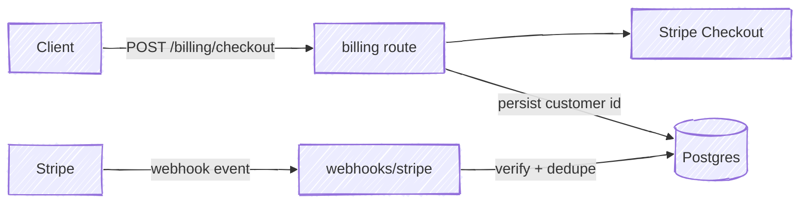

I built a backend service that answers three things for each tenant: how much have they used, what do they owe, and have they hit their limit. It's a small system: two plans, two usage types, one endpoint that simulates an LLM call. Most of the effort went into the parts that don't show up in a demo.

```mermaid
flowchart LR
    Client -->|POST /generate| Meter[MeterService]
    Meter --> Quota[QuotaService]
    Quota -->|ok| Cost[CostService]
    Cost --> DB[(Postgres)]
    Quota -->|over limit| Reject[Rate limit exceeded]

    style Client fill:#1f2020
```

## Idempotency

A client can retry a request. If that retry records usage again, the tenant gets billed twice for one call. So every billable request carries a client-supplied idempotency key, and the same key twice should produce one usage event, not two.

The guarantee lives in the database, as a unique constraint on tenant and idempotency key, not an app-level check-then-insert (that has a gap two requests could both slip through). The app still checks first so a duplicate returns the original result. One limitation: two concurrent requests with the same key could still both pass that check before either write commits. The database constraint would reject the second insert, but the app doesn't handle that rejection yet. Sequential retries are safe; concurrent ones aren't.

## Quotas

Requests over a tenant's quota get rejected with a 429, a lapsed subscription with a 402, and the response says which one it is. The part I tested most was the boundary: a tenant at 999 of 1,000 calls should succeed, at 1,000 should fail. Easy to get off by one, so I seeded tenants right at that line and checked both sides.

## Cost

Cost is stored as an integer in micro-units, not a float, to avoid rounding drift. Pricing also isn't just "tokens times a rate": cached input tokens cost less than fresh input, and reasoning tokens get billed at the output rate instead of being free. I pinned the pricing constants and wrote tests against known token breakdowns so a change to the math would get caught.

## Billing with Stripe integration

Subscription state comes from Stripe over a webhook. It has to verify the signature and ignore events it's already processed, since Stripe retries delivery on its own. I tested both: a forged signature gets rejected, and replaying a real event only applies once.

## Limitations

There's no invoicing, proration, or overage billing. Token counts are simulated rather than coming from a real model call, since the point was metering and billing, not the model itself. I kept the scope small on purpose so I could actually verify the core stayed correct under retries and failures, instead of spreading that effort over more features.
