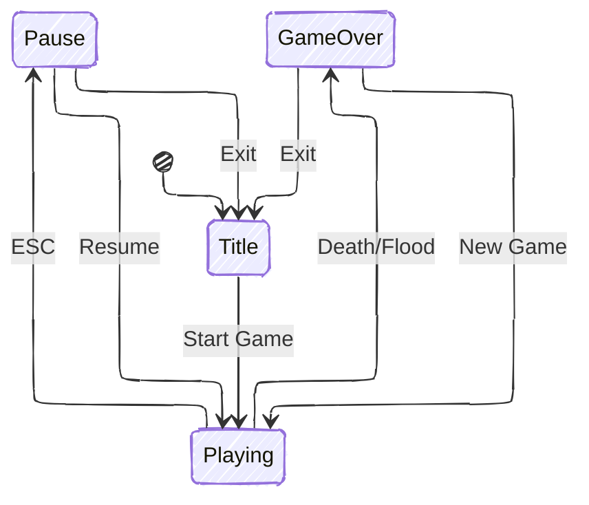

import { Image } from "astro:assets";
import titleScreenImg from "./screenshots/title-screen.png";
import playingImg from "./screenshots/playing.png";
import playingVideo from "./screenshots/playing.mp4";
import playingOnRaftVideo from "./screenshots/playing-on-raft.mp4";
import playerSheet from "./sprites/player-sheet.png";
import debugRenderImg from "./screenshots/debug-render.png";
import worldBuilderImg from "./screenshots/world-builder.png";
import playerSprite from "./sprites/player.gif";
import raftSprite from "./sprites/raft.gif";

Tidal Island is a survival game where you're stranded on a deserted island
and must gather resources and craft items to escape.
You must progress toward building a raft to escape
before the tides get too high and submerge the island!

<iframe
  frameborder="0"
  src="https://itch.io/embed/4147344?linkback=true&amp;border_width=5&amp;bg_color=e8e6e3&amp;fg_color=443e37&amp;link_color=82998f&amp;border_color=c3beb7"
  width="100%"
  height="175"
>
  <a href="https://andrianllmm.itch.io/tidal-island">Tidal Island by Andrian</a>
</iframe>

## Why I built It

Tidal Island was initially developed as a final project
for <a href="https://upvdpsm.com/courses/computer-science/cmsc-22.html" target="_blank">CMSC 22</a>
(Fundamentals of Object-Oriented Programming).[^1]
The task was to apply OOP principles to create a Java application from scratch.

I chose to build a game because (1) I haven't built one yet and (2) it felt like the perfect playground to practice these concepts.
Games naturally involve complex systems, objects interacting with each other, state management, and events
(all of which map to OOP patterns).

## How it turned out

The game is now available on <a href="https://andrianllmm.itch.io/tidal-island/" target="_blank">itch.io</a> for free,
playable by anyone on Windows, Mac, or Linux.

  <Image src={titleScreenImg} alt="Title screen" class="w-full max-w-[300px]" />
  <video
    src={playingOnRaftVideo}
    alt="Playing on a raft"
    class="w-full max-w-[300px]"
    autoplay
    loop
    muted
    playsinline
    preload="metadata"
  />
  <video
    src={playingVideo}
    class="w-full max-w-[300px]"
    autoplay
    loop
    muted
    playsinline
    preload="metadata"
  />
  <Image src={playingImg} alt="Playing still" class="w-full max-w-[300px]" />

## How I built it

### Technologies I used

Java

(yep, that's it...)

### Architecture and Design

Building the game required careful planning of the architecture. I organized the codebase into several key systems:
Game Engine, Collision System, Entity System, Inventory and Crafting, Tidal Mechanics, Event System, and UI System, and more.
You can read more about the architecture in the <a href="https://github.com/andrianllmm/tidal-island/blob/main/docs/system/system.md" target="_blank">docs</a>.

Throughout development, I consciously applied several <a href="https://refactoring.guru/design-patterns" target="_blank">design patterns</a> such as:
Singleton, Builder, Factory/Registry, Observer, State, and Template Method.
I also tried to follow <a href="https://www.oodesign.com/design-principles/" target="_blank">SOLID</a> principles along the way.

### Developer Experience

I built tools to make development less of a headache.
The big thing that helped me is the debug rendering I added to visualize collision boxes, UI elements, and inspect the game state in real-time.

  <Image
    src={debugRenderImg}
    alt="Debug render"
    class="w-full max-w-[300px]"
    data-zoomable
  />
  <Image
    src={worldBuilderImg}
    alt="World builder"
    class="w-full max-w-[300px]"
    data-zoomable
  />

I also created a _World Builder_ for visually designing maps.
It lets you paint tiles, place objects, undo/redo changes, and export everything to JSON that the game loads.

There's also a test suite using JUnit covering core systems to ensure everything works as expected.

### Art

For graphics, I chose pixel art and created most of the sprites myself using <a href="https://www.aseprite.org/" target="_blank">Aseprite</a>.
Being a beginner, I went through a lot of trial and error to get the sprites to look right.
For the player sprite in particular, I started from a base by <a href="https://otterisk.itch.io/hana-caraka-base-character" target="_blank">Hana Caraka</a>
because it already included many animation states, which made the process easier.

  

    <Image
      src={playerSheet}
      alt="Player sheet"
      class="m-4 w-full max-w-[150px] h-auto"
      data-zoomable
    />
  

  

    <Image
      src={playerSprite}
      alt="Player sprite"
      class="m-4 w-full max-w-[100px] h-auto"
      data-zoomable
    />

    <Image
      src={raftSprite}
      alt="Raft sprite"
      class="m-4 w-full max-w-[200px] h-auto"
      data-zoomable
    />

  

## What I learned

This project taught me a lot not only about OOP, but also about game development.

I've always struggled to grasp concepts like SOLID principles and design patterns,
but actually working with inheritance, polymorphism, composition, etc. in a real project made them click in ways that textbook examples never did.

I also faced the hard truth: game development is hard.
Building even a simple 2D game involves solving problems across many domains
(graphics, physics, input handling, state management, performance optimization).

---

[^1]:
    CMSC 22 is a computer science course I took at <abbr title="University of the Philippines Visayas">UPV</abbr>.
    It covers topics such as pillars of OOP, SOLID principles, and Design Patterns.
