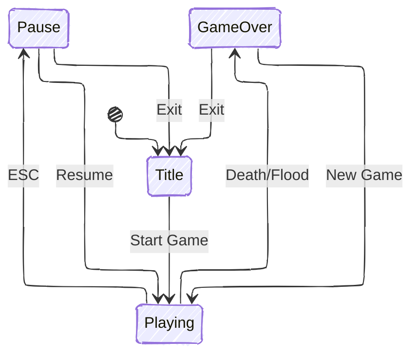

import { Image } from "astro:assets";
import titleScreenImg from "./screenshots/title-screen.png";
import playingImg from "./screenshots/playing.png";
import playingVideo from "./screenshots/playing.mp4";
import playingOnRaftVideo from "./screenshots/playing-on-raft.mp4";
import playerSheet from "./sprites/player-sheet.png";
import debugRenderImg from "./screenshots/debug-render.png";
import worldBuilderImg from "./screenshots/world-builder.png";
import playerSprite from "./sprites/player.gif";
import raftSprite from "./sprites/raft.gif";

<iframe
  frameborder="0"
  src="https://itch.io/embed/4147344?linkback=true&amp;border_width=5&amp;bg_color=e8e6e3&amp;fg_color=443e37&amp;link_color=82998f&amp;border_color=c3beb7"
  width="100%"
  height="175"
>
  <a href="https://andrianllmm.itch.io/tidal-island">Tidal Island by Andrian</a>
</iframe>

Tidal Island is a survival game where you are stranded on a deserted island and
must gather resources, craft items, and build a raft before the rising tide
submerges everything.

## Why I built it

Tidal Island started as a final project for <a href="https://upvdpsm.com/courses/computer-science/cmsc-22.html" target="_blank">CMSC 22</a> (Fundamentals of Object-Oriented Programming).[^1] The requirement was a Java app applying OOP concepts, but I probably would've built a game anyway. I'd never made one, and games have a lot of interacting objects: players, items, resources, inventories, crafting, world events. Much easier to understand OOP when you can see it working than when you're just reading textbook examples.

The idea was inspired by survival games like Minecraft. I wanted something simple but with a complete loop: gather resources, craft tools, escape.

## How it turned out

The game is now available on <a href="https://andrianllmm.itch.io/tidal-island/" target="_blank">itch.io</a> for free and is playable on Windows, Mac, and Linux.

  <Image src={titleScreenImg} alt="Title screen" class="w-full max-w-[300px]" />
  <video
    src={playingOnRaftVideo}
    alt="Playing on a raft"
    class="w-full max-w-[300px]"
    autoplay
    loop
    muted
    playsinline
    preload="metadata"
  />
  <video
    src={playingVideo}
    class="w-full max-w-[300px]"
    autoplay
    loop
    muted
    playsinline
    preload="metadata"
  />
  <Image src={playingImg} alt="Playing still" class="w-full max-w-[300px]" />

The gameplay loop is about surviving long enough to build a raft: collect materials, craft items, manage inventory, all while the tide slowly rises. The tide mechanic ended up being one of the more unique parts, not just because it had to work but because the flooding had to feel natural.

## How I built it

### Technologies I used

Java

(yep, that's it...)

No game engine, everything built from scratch in Java. That meant implementing rendering, input handling, collision detection, object management, and game state myself, things an engine usually hands you for free.

### Architecture and design

The project started small and the architecture grew with it. The final version is organized into several systems:

- Game engine
- Entity system
- Collision system
- Inventory and crafting system
- Tidal mechanics
- Event system
- UI system

You can read more about the architecture in the <a href="https://github.com/andrianllmm/tidal-island/blob/main/docs/system/system.md" target="_blank">documentation</a>.

I applied design patterns like <a href="https://refactoring.guru/design-patterns" target="_blank">Singleton, Builder, Factory/Registry, Observer, State, and Template Method</a>, and tried to follow <a href="https://www.oodesign.com/design-principles/" target="_blank">SOLID</a> where it made sense. What made these finally click was seeing them as actual game objects: a piece of wood isn't just a variable, it's an item with properties, and an inventory is a system that manages those items.

### Developer experience

I also built tools to make development easier. The most useful was a debug rendering system that visualizes collision boxes, UI elements, and other internal state while playing.

  <Image
    src={debugRenderImg}
    alt="Debug render"
    class="w-full max-w-[300px]"
    data-zoomable
  />
  <Image
    src={worldBuilderImg}
    alt="World builder"
    class="w-full max-w-[300px]"
    data-zoomable
  />

I also built a World Builder for designing maps visually, with tile painting, object placement, undo, and JSON export that the game loads directly. The project also has a JUnit test suite covering the important systems.

### Art

For graphics, I chose pixel art and made most of the sprites myself in <a href="https://www.aseprite.org/" target="_blank">Aseprite</a>, still learning as I went, so a lot of trial and error getting animations to look right. For the player character, I started from a base sprite by <a href="https://otterisk.itch.io/hana-caraka-base-character" target="_blank">Hana Caraka</a> since it already had the animation states I needed, and modified it with my own colors.

  

    <Image
      src={playerSheet}
      alt="Player sheet"
      class="m-4 w-full max-w-[150px] h-auto"
      data-zoomable
    />
  

  

    <Image
      src={playerSprite}
      alt="Player sprite"
      class="m-4 w-full max-w-[100px] h-auto"
      data-zoomable
    />

    <Image
      src={raftSprite}
      alt="Raft sprite"
      class="m-4 w-full max-w-[200px] h-auto"
      data-zoomable
    />

  

## What I learned

This project changed how I understood OOP. Before this, SOLID principles, inheritance, polymorphism, and design patterns felt abstract. Building a game gave them a concrete purpose.

I also learned game dev is harder than it looks: even a simple 2D game touches graphics, physics, input handling, state management, tooling, and UX.

---

[^1]:
    CMSC 22 is a computer science course I took at <abbr title="University of the Philippines Visayas">UPV</abbr>. It covers
    topics such as the pillars of OOP, SOLID principles, and design patterns.
