ZipZap is a CLI tool that compresses text files using <a href="https://en.wikipedia.org/wiki/Huffman_coding" target="_blank">Huffman coding</a>. It was built as an experiment in implementing data structures and algorithms from scratch, including priority queues, binary trees, and hash maps.

## Why I built it

I was already interested in how compression worked, and when I learned Huffman coding leans heavily on data structures, it became the obvious choice for my final project in <a href="https://upvdpsm.com/courses/computer-science/cmsc-123.html" target="_blank">CMSC 123</a> (Data Structures).[^1]

The course had us implement data structures ourselves, and I wanted something where those implementations weren't just isolated exercises. A compressor fit because the algorithm depends on several structures working together, giving them a real workload instead of just passing tests.

## How it turned out

Users can use ZipZap as a CLI tool to compress and decompress text files.

```sh
zipzap zip original.txt -o compressed.zz
```

```sh
zipzap zap compressed.zz -o decompressed.txt
```

It gets around 50-60% size reduction on typical text files. It's not meant to compete with <a href="https://www.gnu.org/software/gzip/" target="_blank">gzip</a>, but it does show a full compression and decompression pipeline working end to end.

It also has inspection flags I added during development and kept: `--time` for timing, `--tree` to print the Huffman tree, `--codebook` for the character-to-bit mappings, and `--contents` for the raw encoded bitstream. Useful for seeing what's normally hidden.

## How I built it

The core algorithm follows Huffman coding: count character frequencies, then build a tree by repeatedly combining the least frequent nodes with a priority queue.

For example, given the input:

```
aaaabbcde
```

the frequencies are used to construct a tree where frequently occurring
characters receive shorter binary codes.

```mermaid
---
config:
    look: handDrawn
---

flowchart TD
    Root["9"]

    Root --> L["4: a"]
    Root --> R["5"]

    R --> R1["2: b"]
    R --> R2["3"]

    R2 --> R21["1: c"]
    R2 --> R22["2"]

    R22 --> R221["1: d"]
    R22 --> R222["1: e"]

    style Root fill:#1f2020
```



ZipZap uses <a href="https://en.wikipedia.org/wiki/Canonical_Huffman_code" target="_blank">canonical Huffman codes</a>, so instead of storing the whole tree, it only stores enough metadata to rebuild the codebook on decompression.


All the major data structures are implemented from scratch, no `heapq` or `defaultdict`. The hardest part wasn't the structures themselves but handling raw bits: packing encoded data, tracking unused padding bits, and reconstructing the original text exactly on decompression.

## What I learned

ZipZap gave me a different perspective on data structures. Before this, heaps, trees, and hash maps were mostly things I implemented because a course required them. Building a working compressor showed why they exist and how they interact in a larger system.

It also reinforced how unforgiving compression is: one small mistake in encoding or decoding and the whole output is unusable. This was never about replacing gzip, it was about proving I could turn a textbook concept into working software.

---

[^1]:
    CMSC 123 is a computer science course I took at <abbr title="University of the Philippines Visayas">UPV</abbr>. It covers
    topics such as stacks, queues, trees, and hash maps.
