ZipZap is a CLI tool that compresses text files using <a href="https://en.wikipedia.org/wiki/Huffman_coding" target="_blank"> Huffman coding </a> . It was built as an experiment in implementing data structures and algorithms from scratch, including priority queues, binary trees, and hash maps.

## Why I built it

I was already interested in how compression worked before this project.

When I learned that Huffman coding relies heavily on data structures, it became
a natural choice for my final project in <a href="https://upvdpsm.com/courses/computer-science/cmsc-123.html" target="_blank">CMSC 123</a>
(Data Structures).[^1]

The course required us to implement data structures ourselves, so I wanted a
project where those implementations were not just isolated exercises.
A compressor was a good fit because the algorithm depends on multiple structures
working together.

Instead of just checking whether my data structures passed tests, ZipZap gave
them a real workload.

## How it turned out

Users can use ZipZap as a CLI tool to compress and decompress text files.

```sh
zipzap zip original.txt -o compressed.zz
```

```sh
zipzap zap compressed.zz -o decompressed.txt
```

The tool achieves around 50-60% size reduction on typical text files. It is not intended to compete with production compression tools like <a href="https://www.gnu.org/software/gzip/" target="_blank"> gzip </a>, but it successfully demonstrates the complete compression and decompression
pipeline.

Beyond basic compression, ZipZap includes inspection features:

- `--time` shows compression timing information
- `--tree` displays the generated Huffman tree
- `--codebook` shows the character-to-bit mappings
- `--contents` displays the encoded bitstream

These were originally added during development, but they also make the algorithm
easier to understand by exposing what normally happens behind the scenes.

## How I built it

The core algorithm follows Huffman coding.

Given a text file, ZipZap first counts character frequencies. It then builds a
tree by repeatedly combining the least frequent nodes using a priority queue.

For example, given the input:

```
aaaabbcde
```

the frequencies are used to construct a tree where frequently occurring
characters receive shorter binary codes.

```mermaid
---
config:
    look: handDrawn
---

flowchart TD
    Root["9"]

    Root --> L["4: a"]
    Root --> R["5"]

    R --> R1["2: b"]
    R --> R2["3"]

    R2 --> R21["1: c"]
    R2 --> R22["2"]

    R22 --> R221["1: d"]
    R22 --> R222["1: e"]

    style Root fill:#1f2020
```



ZipZap uses <a href="https://en.wikipedia.org/wiki/Canonical_Huffman_code" target="_blank">canonical Huffman codes</a> for encoding. Instead of storing the entire tree, the compressor stores enough metadata to reconstruct the codebook during decompression.

The compression pipeline looks like this:

```mermaid
---
config:
    look: handDrawn
---

flowchart TD
    START([Input: original.txt]) --> READ[Read text file] --> FREQ_COUNT[Count character frequencies]
    FREQ_COUNT --> |"{'a':5,'b':3,'c':2}"| HEAP_INIT[Initialize min-heap]
    HEAP_INIT --> HEAP_LOOP{Heap size > 1?}
    HEAP_LOOP -->|Yes| POP2[Pop 2 minimum nodes]
    POP2 --> MERGE[Merge into parent node]
    MERGE --> PUSH[Push parent back]
    PUSH --> HEAP_LOOP
    HEAP_LOOP -->|No| TREE_DONE[Huffman tree complete]
    TREE_DONE --> TRAVERSE[Traverse tree and get code lengths]
    TRAVERSE --> CANONICAL[Generate canonical codebook]
    CANONICAL --> ENCODE_CHARS[Encode characters]
    ENCODE_CHARS --> WRITE[Write metadata and packed bytes]
    WRITE --> END([Output: compressed.zz])

    style START fill:#1f2020
```



All major data structures were implemented from scratch.
The project does not rely on Python's built-in equivalents like `heapq` or
`defaultdict`.

The most challenging part was not the data structures themselves, but handling
the actual bits.

Working with individual bits instead of normal bytes introduced many edge cases:
packing encoded data, tracking unused padding bits, and reconstructing the
original text exactly during decompression.

## What I learned

ZipZap gave me a different perspective on data structures.

Before this project, concepts like heaps, trees, and hash maps were mostly things
I implemented because a course required them. Building a working compressor
showed why those structures exist and how they interact inside a larger system.

It also reinforced the importance of correctness. Compression is unforgiving:
a small mistake in encoding or decoding can make the entire output unusable.

This project was not meant to replace existing compression tools. It was an
experiment to understand the algorithms behind them and prove that I could turn
abstract computer science concepts into working software.

---

[^1]:
    CMSC 123 is a computer science course I took at <abbr title="University of the Philippines Visayas">UPV</abbr>. It covers
    topics such as stacks, queues, trees, and hash maps.
