ZipZap is a CLI tool that compresses text files using Huffman coding.
It is made from scratch with custom data structures.

<script
  src="https://asciinema.org/a/764041.js"
  id="asciicast-764041"
  async="true"
></script>

## Why I built it

ZipZap was initially developed as a final project
for <a href="https://upvdpsm.com/courses/computer-science/cmsc-123.html" target="_blank">CMSC 123</a>
(Data Structures).[^1]

I chose to build a compressor using Huffman coding because the algorithm itself
incorporates a lot of data structures: priority queues for building the tree, binary trees for encoding, and hash maps for the codebook.

Considering that I would write all these data structures from scratch,
it can be a good quantitative indicator of how well I implemented them.

## How it turned out

Users can use ZipZap as a CLI tool to compress files
to `.zz` and decompress them back to `.txt`.

```sh
zipzap zip original.txt -o compressed.zz
```

```sh
zipzap zap compressed.zz -o decompressed.txt
```

The tool includes some neat features beyond basic compression.
You can view timing stats with `--time`, inspect the Huffman tree with `--tree`,
or examine the generated codebook with `--codebook`.
There's even a `--contents` flag to see the actual encoded bitstream if you're curious about what's happening under the hood.

Even though it runs slower than production compression tools like <a href="https://www.gnu.org/software/gzip/" target="_blank">gzip</a> (which is expected),
it functionally works as intended.
On typical text files, ZipZap achieves around 50-60% size reduction.

## How I built it

The core algorithm is based on the <a href="https://en.wikipedia.org/wiki/Huffman_coding" target="_blank">Huffman coding</a> algorithm.
This algorithm builds a tree from a set of frequencies and assigns codes to each character.
Here's how the Huffman tree looks like given the input "aaaabbcde":

```mermaid
---
config:
    look: handDrawn
---

flowchart TD
    Root["9"]

    Root --> L["4: a"]
    Root --> R["5"]

    R --> R1["2: b"]
    R --> R2["3"]

    R2 --> R21["1: c"]
    R2 --> R22["2"]

    R22 --> R221["1: d"]
    R22 --> R222["1: e"]

    style Root fill:#1f2020
```



Specifically, it uses <a href="https://en.wikipedia.org/wiki/Canonical_Huffman_code" target="_blank">canonical Huffman codes</a> to encode text,
which makes the compressed format more efficient to store and decode.

Here's how the compression pipeline works:

```mermaid
---
config:
    look: handDrawn
---

flowchart TD
    START([Input: original.txt]) --> READ[Read text file] --> FREQ_COUNT[Count char frequencies]
    FREQ_COUNT --> |"{'a':5,'b':3,'c':2}"| HEAP_INIT[Init min-heap] --> HEAP_LOOP{Heap size > 1?}
    HEAP_LOOP -->|Yes| POP2[Pop 2 min nodes] --> MERGE[Merge into parent] --> PUSH[Push parent back] --> HEAP_LOOP
    HEAP_LOOP -->|No| TREE_DONE[Huffman Tree complete]
    TREE_DONE --> TRAVERSE[DFS code lengths] --> |"{'a':2,'b':3,'c':3}"| CANONICAL[Make codebook with canonical codes] --> ENCODE_CHARS[Encode chars]
    ENCODE_CHARS --> WRITE[Write metadata and packed bytes] --> END([Output: compressed.zz])

    style START fill:#1f2020
```



All the data structures (deque, hash maps, binary trees, priority queues) used were implemented from scratch.
No importing `heapq` or `defaultdict` here.

## What I learned

This project taught me a lot about data structures in a practical setting.
Abstract concepts like "amortized O(1) operations" or "load factor in hash tables" suddenly mattered when they directly affected compression speed or memory usage.

I also learned that implementing data structures from scratch is humbling.
Things that seem simple in theory like collision resolution in hash maps require careful attention to edge cases.

Most importantly, I learned that compression is fascinating.
There's something just deeply satisfying about watching a 50KB text file shrink down to 25KB
without actually losing any information.

---

[^1]:
    CMSC 123 is a computer science course I took at <abbr title="University of the Philippines Visayas">UPV</abbr>.
    It covers topics such as stacks, queues, trees, and hash maps.
